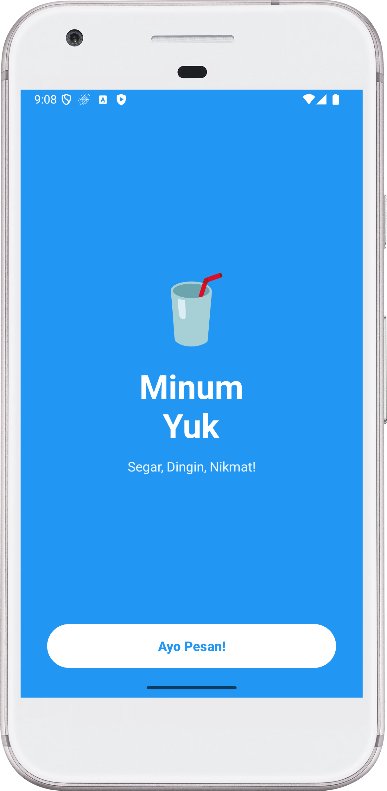
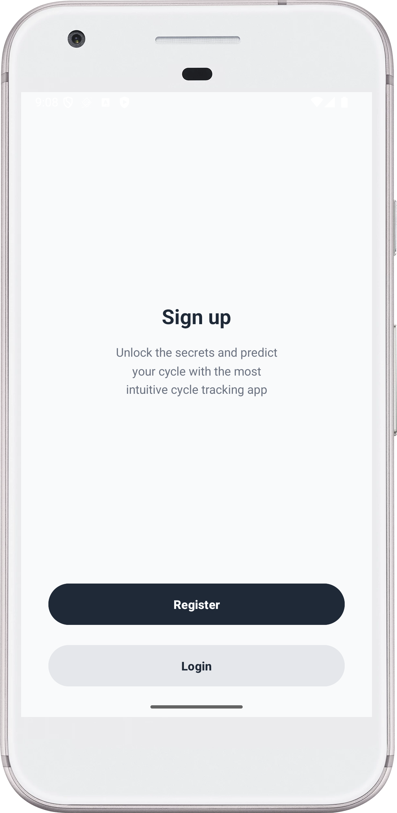
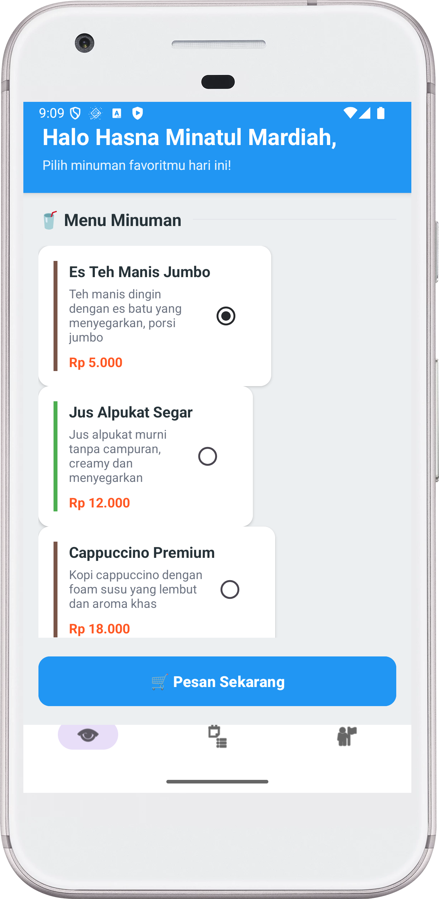
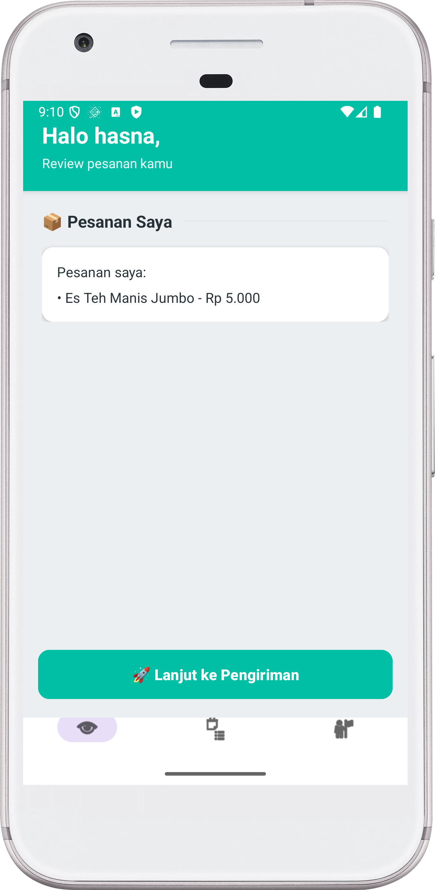
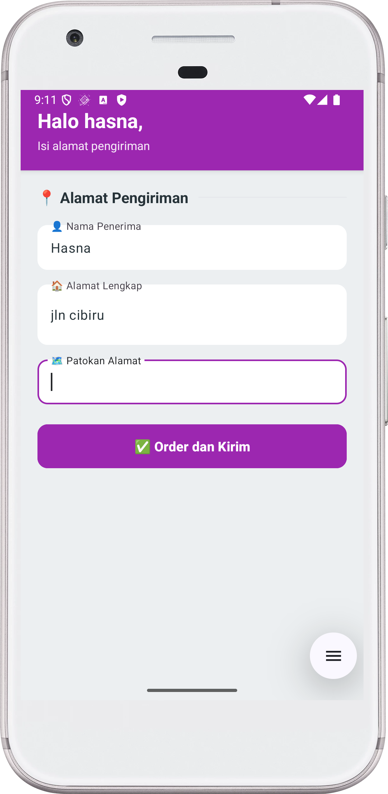
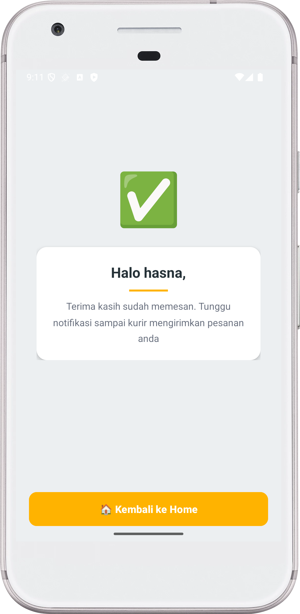

# Minum Yuk - Aplikasi Pemesanan Minuman Segar

Aplikasi Android untuk memesan berbagai minuman segar dan nikmat dengan desain modern dan colorful yang dibuat menggunakan Kotlin dan View Binding.

## Tentang Aplikasi

**Minum Yuk** adalah aplikasi mobile yang memudahkan pengguna untuk memesan berbagai minuman segar dengan antarmuka yang menarik dan user-friendly. Aplikasi ini menampilkan 12 menu minuman dengan informasi lengkap termasuk nama, deskripsi, dan harga.

## ✨ Fitur Utama

- ✅ **Autentikasi User** - Login dan Register
- ✅ **12 Menu Minuman** - Pilihan minuman segar dan nikmat
- ✅ **Review Pesanan** - Melihat detail pesanan sebelum checkout
- ✅ **Input Alamat** - Form pengisian alamat pengiriman yang lengkap
- ✅ **Konfirmasi Pesanan** - Notifikasi sukses setelah order
- ✅ **Bottom Navigation** - Navigasi mudah antar halaman
- ✅ **Desain Modern** - UI/UX menarik dengan warna-warna segar
- ✅ **Material Design** - Menggunakan Material Components

## 📸 Screenshot Aplikasi

Berikut adalah dokumentasi aplikasi yang sudah berjalan dengan sukses:

### 1. Splash Screen

- Background biru cerah dengan emoji minuman 🥤
- Judul "Minum Yuk" dengan tagline "Segar, Dingin, Nikmat!"
- Tombol "Ayo Pesan!" untuk memulai

### 2. Auth Choice

- Pilihan untuk Register atau Login
- Deskripsi singkat aplikasi
- Tombol dengan warna berbeda untuk setiap pilihan

### 3. Login

- Header pink dengan emoji 🔐
- Form login dengan username dan password
- Material TextInputLayout dengan icon
- Password toggle untuk show/hide password
- Tombol "🚀 Login Sekarang" dengan warna pink

### 4. Register

- Header coklat dengan emoji 📝
- Form registrasi lengkap (Nama, Username, Password)
- Material Design Components
- Tombol "🎉 Daftar Sekarang" dengan warna coklat

### 5. Home - Daftar Minuman

- Header biru dengan sapaan personal
- Subtitle "Pilih minuman favoritmu"
- Section title "🥤 Menu Minuman"
- 12 menu minuman dalam card menarik:
  - Es Teh Manis - Rp 5.000
  - Jus Alpukat - Rp 12.000
  - Cappuccino - Rp 18.000
  - Thai Tea - Rp 15.000
  - Lemon Tea - Rp 10.000
  - Milkshake Vanilla - Rp 20.000
  - Smoothie Strawberry - Rp 22.000
  - Es Jeruk - Rp 8.000
  - Kopi Susu Gula Aren - Rp 16.000
  - Matcha Latte - Rp 25.000
  - Bubble Tea - Rp 18.000
  - Blue Ocean Soda - Rp 14.000
- Setiap card menampilkan nama, deskripsi, harga, dan color indicator
- RadioButton terintegrasi dalam card
- Bottom Navigation Bar (Home, Order, Profile)

### 6. Review Pesanan

- Header hijau dengan informasi user
- Subtitle "Review pesanan minuman kamu"
- Card putih menampilkan pesanan yang dipilih
- Tombol "🚀 Lanjut ke Pengiriman" dengan warna hijau
- Bottom Navigation Bar

### 7. Alamat Pengiriman

- Header biru dengan sapaan personal
- Subtitle "Isi alamat pengiriman minuman"
- Form input alamat lengkap:
  - 👤 Nama Penerima
  - 🏠 Alamat Lengkap
  - 🗺️ Patokan Alamat
- Material TextInputLayout dengan icon
- Tombol "✅ Order dan Kirim" dengan warna biru

> **Catatan**: Aplikasi sudah dijalankan dengan sukses dan semua fitur telah diuji. Screenshot di atas merupakan bukti bahwa aplikasi berjalan dengan baik.

## 🛠️ Teknologi yang Digunakan

- **Bahasa**: Kotlin
- **SDK**: Android SDK (Min SDK 24, Target SDK 36)
- **Build Tool**: Gradle 8.13
- **Architecture Pattern**: MVVM (Model-View-ViewModel)
- **UI Components**:
  - View Binding
  - Material Design Components
  - ConstraintLayout
  - ScrollView
  - Material TextInputLayout
  - Material CardView
  - Bottom Navigation View

## 📁 Struktur Project

```
PraktikumWireframe/
├── app/
│   ├── src/
│   │   ├── main/
│   │   │   ├── java/com/example/praktikumwireframe/
│   │   │   │   ├── SplashActivity.kt          # Splash screen
│   │   │   │   ├── AuthChoiceActivity.kt      # Pilihan auth
│   │   │   │   ├── LoginActivity.kt           # Login
│   │   │   │   ├── RegisterActivity.kt        # Register
│   │   │   │   ├── HomeActivity.kt            # Daftar minuman
│   │   │   │   ├── OrderReviewActivity.kt     # Review pesanan
│   │   │   │   ├── AddressActivity.kt         # Input alamat
│   │   │   │   ├── ConfirmActivity.kt         # Konfirmasi
│   │   │   │   ├── FoodItem.kt                # Data class minuman
│   │   │   │   └── OrderData.kt               # Singleton data order
│   │   │   ├── res/
│   │   │   │   ├── layout/                    # Layout files
│   │   │   │   ├── values/
│   │   │   │   │   ├── colors.xml             # Definisi warna
│   │   │   │   │   └── strings.xml
│   │   │   │   ├── menu/
│   │   │   │   │   └── menu_bottom.xml
│   │   │   │   └── drawable/
│   │   │   └── AndroidManifest.xml
│   │   └── build.gradle.kts
│   └── ...
├── screenshot/                                 # Folder screenshot (7 files)
│   ├── 01_splash.png
│   ├── 02_auth_choice.png
│   ├── 03_login.png
│   ├── 04_register.png
│   ├── 05_home.png
│   ├── 06_order_review.png
│   └── 07_address.png
└── README.md
```

## Skema Warna

Aplikasi menggunakan skema warna yang segar dan menarik untuk tema minuman:

- **Blue Drink**: `#2196F3` - Splash, Home header, Address
- **Pink Drink**: `#E91E63` - Login header dan button
- **Brown Drink**: `#795548` - Register header dan button
- **Green Drink**: `#4CAF50` - Order review
- **Dark Gray**: `#1F2937` - Text primary
- **Light Gray Background**: `#F9FAFB` - Background
- **Medium Gray**: `#9CA3AF` - Text secondary

## Cara Menjalankan Aplikasi

### Prasyarat
- Android Studio Arctic Fox atau lebih baru
- JDK 11 atau lebih tinggi
- Android SDK dengan API Level 24 atau lebih tinggi
- Emulator Android atau perangkat fisik

### Langkah-langkah

1. **Clone Repository**
   ```bash
   https://github.com/hasnaaaaam/Hasna/tree/main/PraktikumWireframe
   cd PraktikumWireframe
   ```

2. **Buka di Android Studio**
   - Buka Android Studio
   - File → Open → Pilih folder project
   - Tunggu Gradle sync selesai

3. **Build Project**
   ```bash
   ./gradlew build
   ```
   atau melalui Android Studio: Build → Make Project

4. **Run Aplikasi**
   - Pilih device/emulator
   - Klik tombol Run (▶️) atau Shift+F10
   - Aplikasi akan terinstall dan berjalan

## Komponen Utama

### Data Classes

**FoodItem.kt**
```kotlin
data class FoodItem(
    val id: Int,
    val name: String,
    val description: String,
    val price: String,
    val colorRes: Int
)
```

**OrderData.kt** - Singleton untuk menyimpan data pesanan
```kotlin
object OrderData {
    var namaUser: String = ""
    val makananDipilih = mutableListOf<String>()
    var namaPenerima: String = ""
    var alamat: String = ""
    var patokan: String = ""
}
```

### Activities

1. **SplashActivity** - Landing page dengan branding minuman
2. **AuthChoiceActivity** - Pemilihan Login/Register
3. **LoginActivity** - Autentikasi user
4. **RegisterActivity** - Pendaftaran user baru
5. **HomeActivity** - Menampilkan 12 menu minuman
6. **OrderReviewActivity** - Review pesanan sebelum checkout
7. **AddressActivity** - Input alamat pengiriman
8. **ConfirmActivity** - Konfirmasi pesanan berhasil

## Flow Aplikasi

```
Splash Screen
    ↓
Auth Choice (Register/Login)
    ↓
Login/Register Form
    ↓
Home (Pilih Minuman)
    ↓
Order Review
    ↓
Address Input
    ↓
Confirmation
    ↓
Back to Home
```

## Fitur Khusus

### 1. Dynamic Drink List
- Menu minuman di-generate secara dinamis dari FoodData
- Setiap item memiliki color indicator yang berbeda
- Click anywhere on card untuk memilih

### 2. Material Design Components
- TextInputLayout dengan icon dan hint animasi
- Password toggle untuk show/hide
- CardView dengan elevation dan rounded corners
- Bottom Navigation dengan custom styling

### 3. Data Persistence
- Menggunakan Singleton pattern untuk OrderData
- Data user dan pesanan tersimpan selama session

### 4. User Experience
- Sapaan personal di setiap halaman
- Toast notification untuk validasi
- Smooth navigation flow
- Responsive design dengan tema minuman yang konsisten

## 📝 Dependencies

```kotlin
dependencies {
    implementation(libs.androidx.core.ktx)
    implementation(libs.androidx.appcompat)
    implementation(libs.material)
    implementation(libs.androidx.activity)
    implementation(libs.androidx.constraintlayout)
}
```

## 👩‍💻 Developer Profile

- **Nama:** Hasna Minatul Mardiah  
- **NIM:** 1237050024  
- **GitHub:** [hasnaaaaam](https://github.com/hasnaaaaam)  
- **Mata Kuliah:** Pemrograman Aplikasi Mobile

## 📄 Status Build

✅ **Build Successful** - Aplikasi telah berhasil di-compile dan dijalankan
✅ **All Features Working** - Semua fitur berjalan dengan baik
✅ **Screenshots Documented** - 7 screenshot tersedia di folder `/screenshot`

##  Terima Kasih


**© 2025 Minum Yuk - Aplikasi Pemesanan Minuman Segar**

*Teknologi yang digunakan Kotlin, Android Studio, & Material Design Coomponents*

*Build Date: October 30, 2025*
